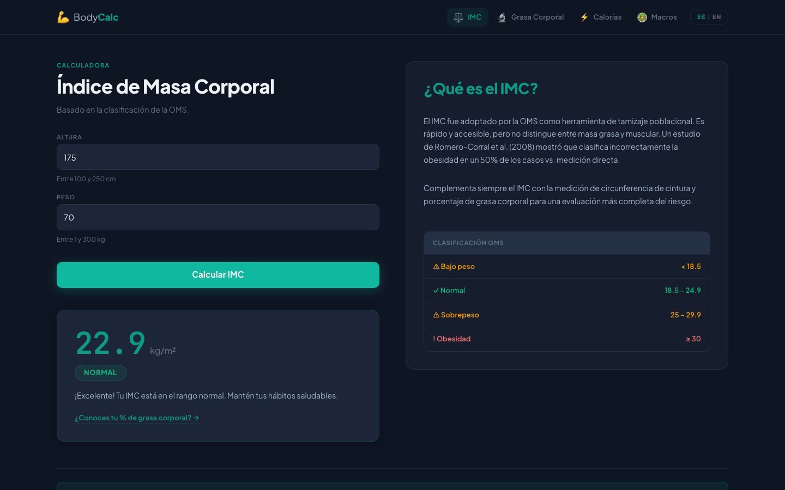
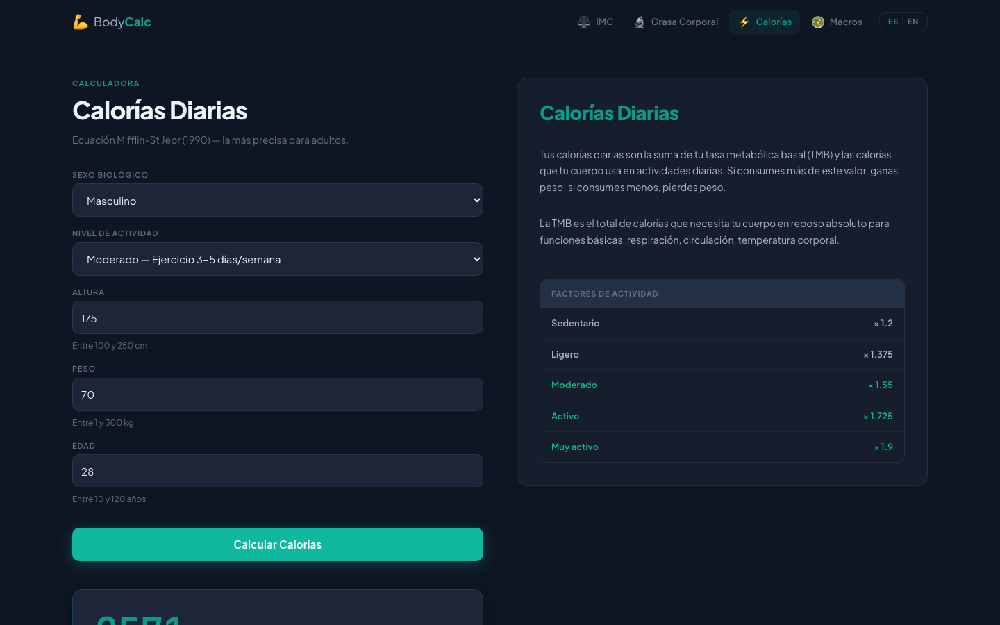
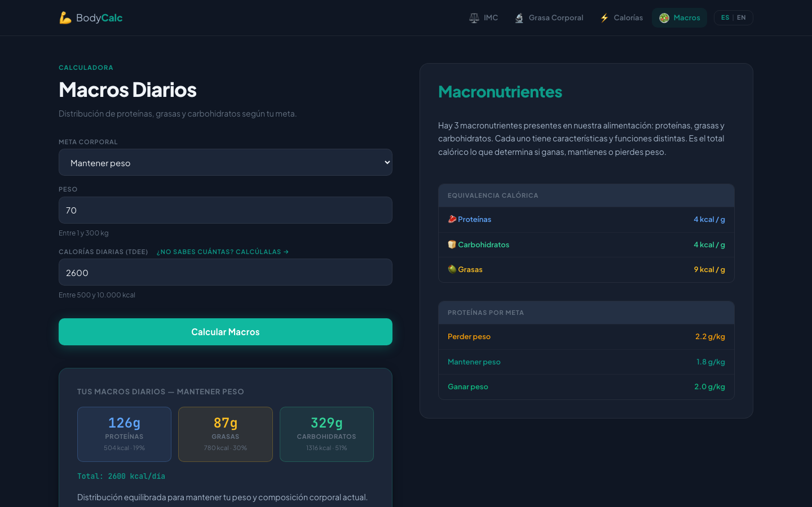

# BodyCalc — Plataforma de Composición Corporal

> **Calculadoras científicas de salud en cadena: ingresa tus datos una vez y fluyen automáticamente hacia cada métrica.**

[](https://github.com/castellanosfelipe/Body_Calc/actions/workflows/deploy.yml)
[](https://castellanosfelipe.github.io/Body_Calc/)
[](./LICENSE)

**[→ Ver demo en vivo](https://castellanosfelipe.github.io/Body_Calc/)**

---

## El problema

La mayoría de las personas que buscan mejorar su salud se enfrentan a dos obstáculos:

1. **Dispersión de herramientas.** Calculan su IMC en un sitio, sus calorías en otro y sus macros en una app de pago. Los datos no se comunican entre sí.
2. **Falta de contexto científico.** Los resultados aparecen sin explicación de qué significan ni qué hacer con ellos.

BodyCalc resuelve ambos problemas en una sola plataforma gratuita, sin registros ni publicidad.

---

## La solución

Una cadena de 4 calculadoras conectadas por un estado compartido. Los datos que ingresas en la primera calculadora se heredan automáticamente a las siguientes, eliminando la fricción de re-ingresar la misma información.

```
IMC → Grasa Corporal → Calorías Diarias → Macros Diarios
 ↕         ↕               ↕                   ↕
altura    sexo           TDEE resultado   → pre-llena
peso      altura         todos los campos   CaloriasTarget
```

Cada calculadora incluye además una sección de recursos científicos con estudios citados (PubMed, WHO, ACSM) y videos educativos, para que el usuario entienda *por qué* su resultado importa.

---

## Capturas de pantalla

### Inicio — Selección de métrica


### Calculadora IMC — Resultado con clasificación OMS



### Calculadora de Calorías — TDEE con desglose completo



### Calculadora de Macros — Distribución por gramos y porcentaje



---

## Funcionalidades clave

| Calculadora | Fórmula científica | Qué produce |
|---|---|---|
| **IMC** | Quetelet / clasificación OMS | Índice + categoría con color + mensaje |
| **Grasa Corporal** | US Navy (Hodgdon & Beckett, 1984) | % grasa + clasificación ACSM por sexo |
| **Calorías Diarias** | Mifflin-St Jeor (1990) + factores PAL | TDEE + desglose TMB / déficit / mantenimiento / superávit |
| **Macros Diarios** | Ratios ISSN por objetivo | g y kcal de proteínas, grasas y carbohidratos |

### Otras características

- **Herencia de datos en cadena** — Vuex comparte perfil entre calculadoras (sexo, altura, peso, edad, TDEE)
- **Toggle ES / EN** — interfaz completa en español e inglés, preferencia persistida en `localStorage`
- **Recursos científicos por calculadora** — estudios PubMed, guías OMS/ACSM, videos educativos
- **Diseño oscuro con tokens de diseño** — sistema de variables CSS coherente, responsive
- **Deploy automático** — GitHub Actions publica en GitHub Pages en cada push a `Construction`

---

## Para quién es

| Perfil | Caso de uso |
|---|---|
| Persona que empieza a hacer ejercicio | Entiende su punto de partida sin necesidad de un nutricionista |
| Atleta recreativo | Calcula sus macros exactos según su TDEE real |
| Estudiante de nutrición o fitness | Referencia rápida con fórmulas y fuentes científicas citadas |
| Desarrollador frontend | Ejemplo de Vue 2 + Vuex + vue-i18n con diseño oscuro completo |

---

## Stack técnico

- **Vue 2.6** — Options API, componentes SFC
- **Vuex 3** — estado compartido entre calculadoras
- **Vue Router 3** — navegación SPA en modo hash
- **vue-i18n 8** — internacionalización ES/EN
- **Bootstrap-Vue 2** — componentes de formulario
- **TypeScript 4.1** — tipado en `store`, `router` y vistas
- **CSS Custom Properties** — design tokens centralizados
- **GitHub Actions** — CI/CD hacia GitHub Pages

---

## Cómo correrlo localmente

```bash
# Instalar dependencias
npm install

# Servidor de desarrollo (con hot-reload)
npm run serve

# Build para producción
npm run build

# Lint
npm run lint
```

> **Nota:** El proyecto usa webpack 4 + Node.js 18+. La variable `NODE_OPTIONS=--openssl-legacy-provider` ya está configurada en los scripts de `package.json`.

---

## Deploy

El workflow `.github/workflows/deploy.yml` compila y publica automáticamente en la rama `gh-pages` cada vez que se hace push a `Construction`.

Para activar GitHub Pages manualmente:
1. Ve a **Settings → Pages** en el repositorio
2. Selecciona la rama `gh-pages` como fuente
3. El sitio quedará disponible en `https://castellanosfelipe.github.io/Body_Calc/`

---

## Licencia

Este proyecto está disponible bajo la licencia MIT. Consulta el archivo [`LICENSE`](LICENSE) para ver los términos completos.

---

<p align="center">Hecho con Vue.js · Fórmulas respaldadas por evidencia científica</p>
